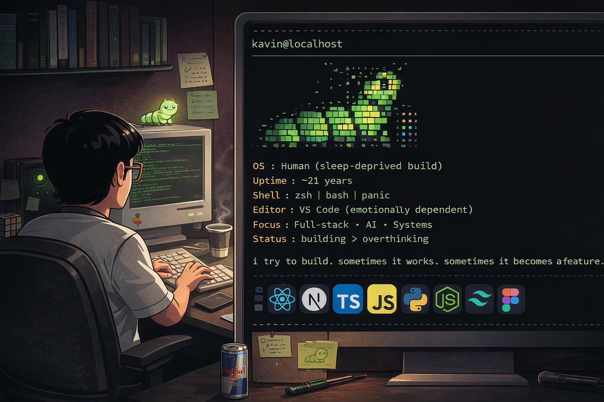

<p align="center">
  
</p>

<p align="center">
  
</p>

```bash
kavin@caterpillhub
──────────────────────────────────────────────
OS        : Human (sleep-deprived build)
Uptime    : ~21 years
Shell     : zsh | bash | panic
Editor    : VS Code (emotionally dependent)
Focus     : Full-stack · AI · Systems
Status    : building > overthinking
````

<table align="center">
<tr>

<td align="center" width="45%">


<br/><br/>

<i>
i try to build.<br/>
sometimes it works.<br/>
sometimes it becomes a feature.
</i>

</td>

<td align="center" width="55%">

### 🧰 TECH I ACTUALLY TOUCH


<br/>

<sub>if it’s not here, i probably googled it once and moved on.</sub>

</td>

</tr>
</table>

<table align="center">
<tr>

<td align="center" width="55%">

```bash
✔ broke something
✔ fixed it
✘ introduced 2 new bugs
✔ committed anyway
```

<i>production-grade decision making</i>

</td>

<td align="center" width="45%">


</td>

</tr>
</table>

## 🖥️ SYSTEM INFO

```bash
OS        : caffeineOS
Kernel    : overthinking-6.9.0
Shell     : zsh
Editor    : VS Code
CPU       : curiosity @ 100%
GPU       : caffeine-integrated
Memory    : always full
```

## 📡 CONNECT

<p align="center">
  <a href="https://www.linkedin.com/in/kavin-rrahul-3710b4261">
    
  </a>
  <a href="mailto:kavinmsoff@gmail.com">
    
  </a>
</p>